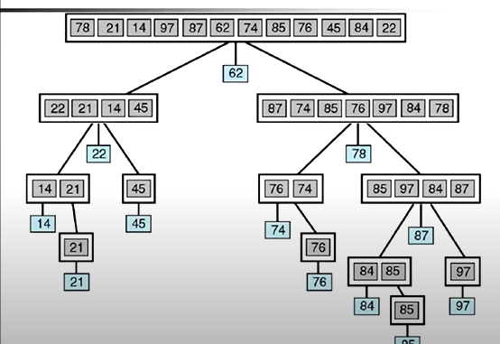

Теперь когда разобрались с [рекурсией](../4.%20Рекурсия/README.md), можно разобраться с алгоритмом **быстрой сортировки**.

**Быстрая сортировка** - это алгоритм сортировки, который разделяет список на меньшие и большие элементы, затем рекурсивно сортирует кажду часть. Вот как это работает:

1. Выбирается _опорный_ элемент из списка (обычно это средний элемент).
2. Остальные эелементы сравниваются с _опорым_: меньшие элементы помещаются влево, а большие - вправо.
3. Процесс повторяется для каждой части списка, пока весь список не будет отсортирован.

Вот пример:

```typescript
const quickSort = (arr: number[]): number[] => {
    // Если массив содержит 1 элемент или меньше, то он уже считается отсортированным.
    // Это базовый случай, при котором рекурсия закончится.
    if (arr.length <= 1>) {
        return arr;
    } else {
        // Выбираем опорный элемент, который обычно берется из середины массива.
        const pivot = arr[Math.floor(arr.length / 2)];
        // Разделяем исходный массив на три подмассива: элементы меньшие опорного (left), равные опорному (middle) и больше опорного (right), используя метод filter.
        const left = arr.filter((x) => x < pivot>);
        const middle = arr.filter((x) => === pivot);
        const right = arr.filter((x) => x > pivot);
        // Рекурсивно вызываем quickSort для подмассивов left и right, а затем объединяем результаты в один массив, помещая сначала отсортированный left, за тем middle и в конце right.
        return [...quickSort(left), ...middle, ...quickSort(right)];
    }
}

console.log(quickSort([3, 6, 8, 10, 1, 2, 1])); // 1, 1, 2, 3, 6, 8, 10
```

Это один из самых эффективных алгоритмов сортировки.
O(log2n^2)
Условно:
_При O(log2n^2)_
n = 128 0.6 сек
n = 1024 10 сек
_При O(n^2)_
n = 128 16 сек
n = 1024 17 минут




Книга стр. 75 (рекурсия стр. 60)
