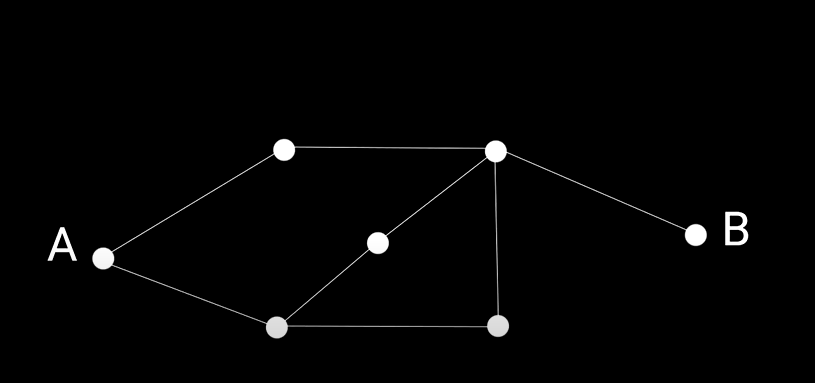
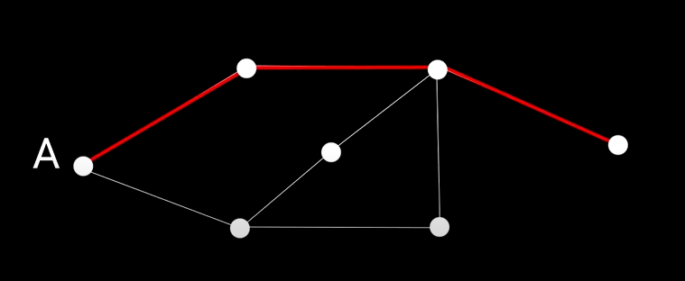
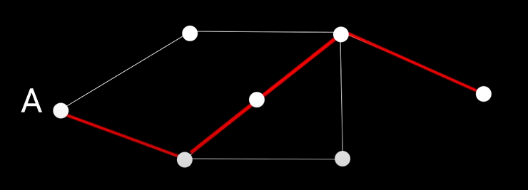
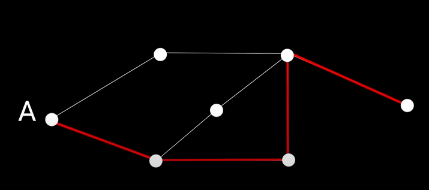
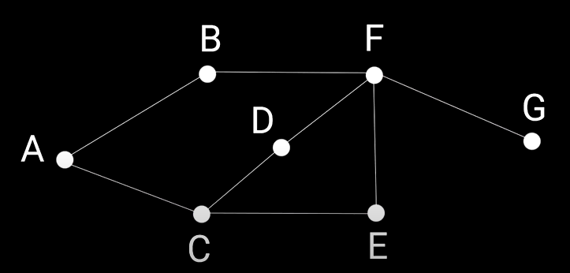
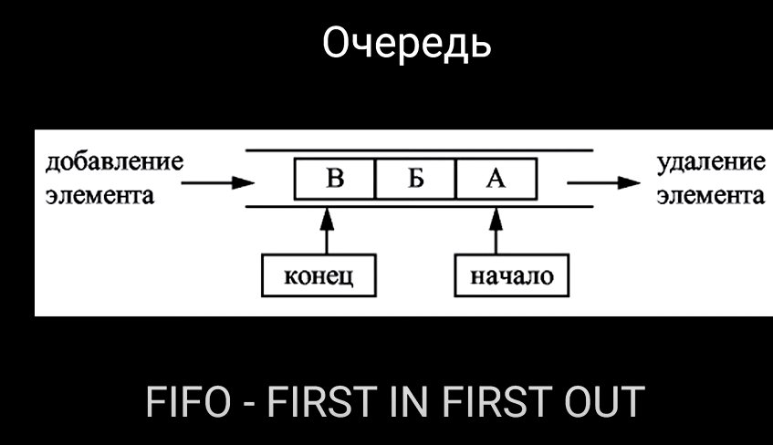

**Графы** - это структура данных представляющая собой набор вершин, связанных друг с другом ребрами.

**Грокаем алгоритмы - стр. 127 (гл. 6. Поиск в ширину)**

Это набор точек, которые соединены линиями. Каждая точка называется **вершиной**, а линии - **ребрами**.

Графы используются для решения разных задач. Напр., найти кратчайший маршрут на карте или определить, какие люди в соцсети связаны друг с другом.

Также графы могут быть направленными (когда линии имеют стрелки) и ненаправленными (когда стрелки отсутствут).

**Поиск в ширину**.



**Поиск в ширину (BFS - Breadth-First Search)** - это алгоритм, который используется для обхода или поиска вершин в графе. Он начинается с заданной стартовой вершины и последовательно перебирает все соседние вершины на одном уровне перед движением на следующий уровень.

Простыми словами, поиск в ширину работает так:

мы начинаем с определенной точки и проверяем ее соседей. Затем мы переходим к соседям соседей и так далее, распространяясь по графу "в ширину". Таким образом, BFS ищет ближайшие вершины, прежде чем переходить к более удаленным.

Т.е. нужно найти путь из точки А в точку B за минимальное количество шагов.
Способ за 3 шага:

Способ за 4 шага:

Способ за 4 шага:


Зададим для каждой вершины название:

И начнем решать задачу. Нужной найти кратчайший путь из А в G.

Граф в коде можно представить следующим образом:

```typescript
// Создаем объект, поля которого - это вершины. Каждое поле равняется массиву вершин, которые и есть путь.
const graph = {};
// Т.е. из А есть путь в B и С
graph.a = ["b", "c"];
// Из В есть путь в F
graph.b = ["f"];
// Из С есть путь в D и Е и т.д.
graph.c = ["d", "e"];
graph.d = ["f"];
graph.e = ["f"];
graph.f = ["g"];
```

В этом алгоритме будет использоваться такая структура данных, как **очередь**.

**Очередь** - это структура данных, состоящая из каких-то элементов. Основной прицип заключается в том, что все элементы добавляются в конец структуры, а извлекаются из ее начала.

Прямо как в жизни: тот, кто пришел на кассу первым, тот и уходит первым, пришел последним - ушел последним (FIFO - First In First Out).



Теперь можно реализовать функцию поиска в ширину:

```typescript
function breadSearch(graph: number[][], start: number, end: number): void {
  // Создаем очередь
  let queue: number[] = [];
  // Сразу в эту очередь добавляем первый элемент
  queue.push(start);

  // Пока очередь больше 0
  while (queue.length > 0) {
    // Создаем текущий элемент очереди curr (из начала очередь достаем текущую вершину)
    const curr = queue.shift();
    // Если по текущей вершине в графе ничего нет, то присваиваем по этой текущей вершине пустой массив, т.е. из этой вершины никуда пути нет
    if (!graph[curr]) {
      graph[curr] = [];
    }

    // Если в графе по текущей вершине массив содержит конечную точку, то завершаем выполнение программы и возвращаем true (т.е. точка найдена (короткий маршрут)), т.е. на данном этапе мы обошли весь граф и пришли к пункту назначения end
    if (graph[curr].icludes(end)) {
      return true;
    } else {
      // Если нет, то добавляем в очередь новые вершины: добавляем то, что находится в очереди в массив и в конец разворачиваем массив, который лежит в графе по текущей вершине
      queue = [...queue, queue[curr]];
    }
  }
}

console.log(breadSearch(graph, "a", "g")); // Есть ли путь из точки А в точку G + найдет самый короткий вариант - true
```

Вот еще пример. Может быть, станет понятнее:

```typescript
function bfs(graph: number[][], startVertex: number): void {
  const queue: number[] = []; // Создаем пустую очередь
  const visited: boolean[] = new Array(graph.length).fill(false); // Создаем массив для отслеживания посещенных вершин и заполняем его значениями false

  queue.push(startVertex); // Добавляем начальную вершину в очередь
  visited[startVertex] = true; // Помечаем начальную вершину как посещенную

  while (queue.length > 0) {
    // Запускаем цикл, пока очередь не пуста
    const currentVertex = queue.shift()!; // Удаляем первый элемент из очереди и используем его как текущую вершину
    console.log(currentVertex); // Выводим текущую вершину

    for (let i = 0; i < graph.length; i++) {
      // Обходим все вершины графа
      if (graph[currentVertex][i] === 1 && !visited[i]) {
        // Если существует ребро между текущей вершиной и i и i еще не была посещена
        queue.push(i); // Добавляем вершину i в очередь
        visited[i] = true; // Помечаем вершину i как посещенную
      }
    }
  }
}

// Пример использования

const adjacencyMatrix: number[][] = [
  [0, 1, 1, 0, 0],
  [1, 0, 0, 1, 0],
  [1, 0, 0, 1, 1],
  [0, 1, 1, 0, 1],
  [0, 0, 1, 1, 0],
];

bfs(adjacencyMatrix, 0); // Выполняем поиск в ширину, начиная с вершины 0
```

1. Объявляем функцию bfs, которая принимает матрицу смежности графа и начальную вершину в качестве параметров, и не возвращает никакого значения.
2. Создаем пустую очередь queue, которая будет использоваться для обхода вершин.
3. Создаем массив visited для отслеживания посещенных вершин. Этот массив будет иметь длину, равную количеству вершин в графе, и будет заполнен значениями false.
4. Добавляем начальную вершину в очередь queue.
5. Помечаем начальную вершину как посещенную в массиве visited.
6. Запускаем цикл while, который будет выполняться до тех пор, пока очередь queue не опустеет.
7. Удаляем первый элемент из очереди queue и используем его как текущую вершину в обходе.
8. Выводим текущую вершину в консоль.
9. Обходим все вершины графа с помощью цикла for.
10. Если существует ребро между текущей вершиной и вершиной i, и вершина i еще не была посещена, то добавляем вершину i в очередь queue и помечаем ее как посещенную в массиве visited.
11. После завершения цикла while функция bfs завершается.
12. Затем мы создаем матрицу смежности adjacencyMatrix, которая представляет пример графа.
13. Вызываем функцию bfs, передавая ей матрицу смежности и начальную вершину 0 в качестве аргументов.
