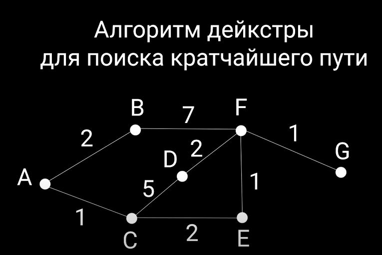
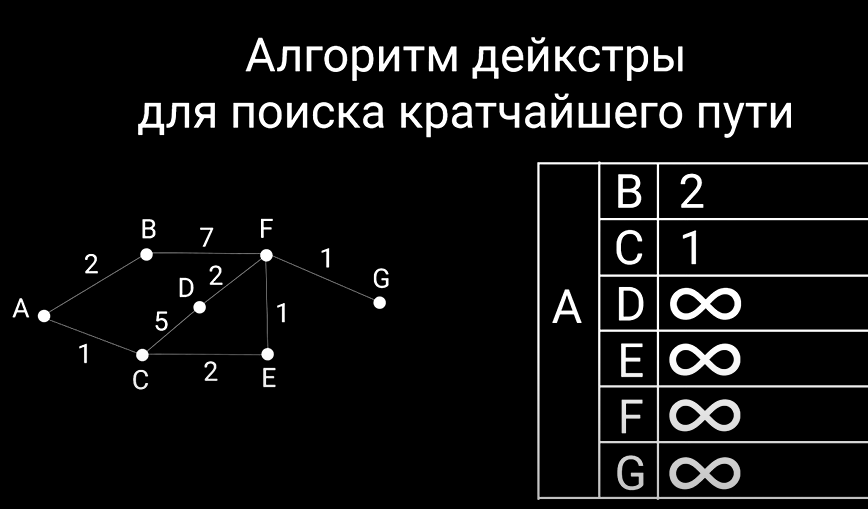
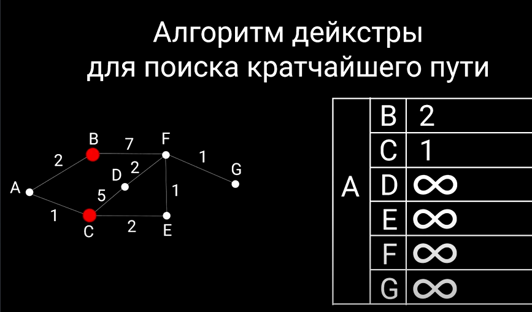
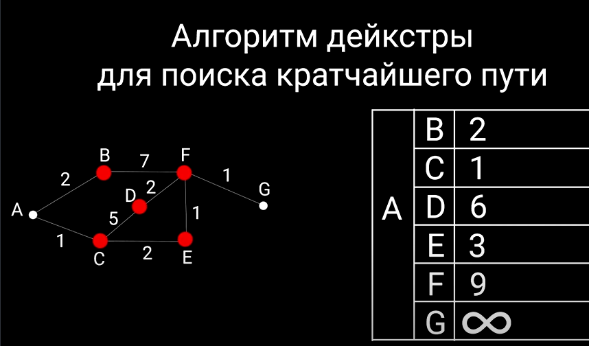
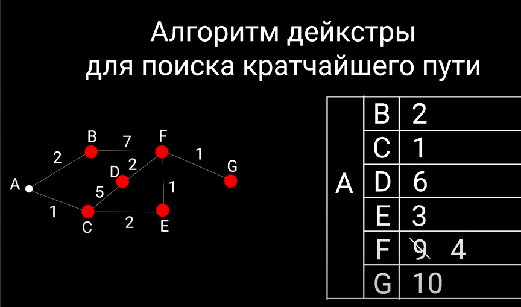
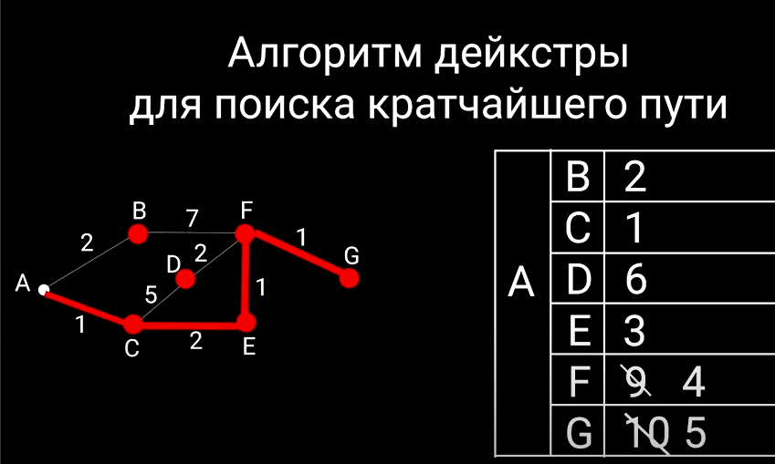

**Грокаем алгоритмы - стр. 151 (гл. 7. Алгоритм Дейкстры)**

**Алгоритм Дейкстры** - это алгоритм, который помогает найти кратчайший путь от одной вершины до всех остальных вершин в графе.

Пример реализации:

```javascript
const dijkstra = (graph, start) => {
  // Объект для хранения расстояний от начальной вершины до остальных
  const distances = {};
  // Объект для хранения предыдущих вершин на кратчайшем пути
  const previous = {};
  // Массив для хранения непосещенных вершин
  const unvisited = [];

  for (let vertex in graph) {
    // Устанавливаем расстояние до каждой вершины как бесконечность
    distances[vertex] = Infinity;
    // Предыдущая вершина на пути к каждой вершине пока неизвестна
    previous[vertex] = null;
    // Добавляем все вершины графа в массив непосещенных
    unvisited.push(vertex);
  }
  // Расстояние от начальной вершины до самой себя равно 0
  distances[start] = 0;

  // Пока есть непосещенные вершины
  while (unvisited.length > 0) {
    // Текущую вершину инициализируем как null
    let current = null;

    for (let vertex of unvisited) {
      if (current === null || distances[vertex] < distances[current]) {
        // Находим вершину с минимальным расстоянием от начальной вершины
        current = vertex;
      }
    }

    if (current === null) {
      // Если не удалось найти текущую вершину, выходим из цикла
      break;
    }

    // Удаляем текущую вершину из массива непосещенных
    unvisited.splice(unvisited.indexOf(current), 1);

    for (let neighbor in graph[current]) {
      // Вычисляем новое расстояние до соседней вершины
      let distance = (distances =
        distances[current] + graph[current][neighbor]);

      if (distance < distances[neighbor]) {
        // Обновляем расстояние до соседней вершины, если новое расстояние меньше текущего
        distances[neighbor] = distances;
        // Устанавливаем текущую вершину, как предыдущую для соседней вершины
        previous[neighbor] = current;
      }
    }
  }

  // Возвращаем объект с кратчайшими расстояниями и предыдущими вершинами
  return { distances, previous };
};

const graph = {
  A: { B: 4, C: 2 },
  B: { E: 3 },
  C: { D: 2 },
  D: { B: 1, E: 5 },
  E: {},
};
const start = "A";

console.log(dijkstra(graph, start));
// distances: { A: 0, B: 4, C: 2, D: 4, E: 7 }
// previous: { A: null, B: 'A', C: 'A', D: 'C', E: 'B' }
```

Это означает, что кратчайшие расстояния от вершины 'A' до остальных вершин равны { A: 0, B: 4, C: 2, D: 4, E: 7 }. И предыдущие вершины на кратчайшем пути от начальной вершины до каждой из них заданы как { A: null, B: 'A', C: 'A', D: 'C', E: 'B' }.

Таким образом, наименьшее расстояние от вершины 'A' до вершины 'E' составляет 7, а кратчайший путь будет следующим: 'A' -> 'C' -> 'D' -> 'B' -> 'E'.

Это пример результата работы алгоритма Дейкстры для указанного графа и начальной вершины.

**Вот еще вариант объяснения**

Если при **поиске в ширину** мы ищем кратчайший путь, передвигаясь по вершинам графа и не важно длительный этот путь или нет. Самое главное - это количество пройденных участков. То в алгоритме Дейкстры учитывается и длина пройденного ребра, так называемый вес.

На рисунке видно, что предыдущий путь, который мы искали поиском в ширину (A, B, F, G) в данном случае оказывается не самым быстрым, т.к. расстояние от B до F целых 7 единиц.


В данной ситуации необходимо воспользоваться алгоритмом Дейкстры, чтобы высчитать оптимально короткий путь и до браться до пункта назначения за кратчайший промежуток времени.

**Кратко о логике работы этого алгоритма**.


1. За стартовую точку принимаем А, а за конечную G. Составляется таблица, в которую на первом этапе записываются значения тех вершин, в которые мы можем попасть из стартовой точки (А). Все остальные вершины являются недостижимыми и их помечаем знаком бесконечности.



2. На втором этапе мы помечаем эти вершины, как уже рассмотренные.



3. На третьем этапе мы рассматриваем вершины, в которые мы можем попасть из точек B и C. И в таблицу записываем значения от точки А до точек, которых мы достигаем из вершин B и C. Снова помечаем эти точки, как уже рассмотренные.



4. На следующем этапе мы достигаем точки G, но у нас происходит перерасчет. Мы находим путь до точки F, который оказывается короче. И перезаписываем значение в таблице.



5. На следующем этапе проделываем все то же самое и находим самый кратчайший (оптимальный) путь. И узнаем, что из точки А в точку G мы можем добаться за 5 условных единиц.

**В коде это выглядит так:**

```javascript
// Теперь каждой вершине графа соответствует не массив, а объект с рассмоянием между двух вершин
const graph = {};
graph.a = { b: 2, c: 1 };
graph.b = { f: 7 };
graph.c = { d: 5, e: 2 };
graph.d = { f: 2 };
graph.e = { f: 1 };
graph.f = { g: 1 };
graph.g = {};

// Принимает граф, начальную точку и конечную
const shortPath = (graph, start, end) => {
  // Создаем объект - это та самая таблица, в которой будем хранить кратчайшие пути
  const costs = {};
  // Массив, в котором будут храниться те узлы, которые мы уже проверили
  const processed = [];
  // Объект, в котором будем хранить соседние вершины рассматриваемого узла
  const neighbors = {};

  // Далее заполняем таблицу, как было указано выше в объяснении и заполнить те вершины, до которых мы можем добраться из стартовой точки, значениями, а остальные должны заполнить бесконечным числом.
  Object.keys(graph).froEach((node) => {
    // У нашего графа получаем список ключей (это как раз будут все вершины) и итерируемся по ним
    if (node !== start) {
      // Если текущий момент итерации не равен стартовой, то заполняем значения.
      // Т.е. граф - это объект, у которого есть поля, где каждое поле - это вершина и каждое поле также является объектом, у которого тоже есть какие-то значение, то это значение мы пытаемся получить у стартовой позиции, т.е. в данном случае у вершины А и получить значение вершины либо B, либо С
      let value = graph[start][node];
      // Затем это значение нужно добавить в таблицу, в которо будут храниться значения как раз кратчайших путей.
      // Если это value мы нашли, если из точки А есть в эту вершину путь, то добавляем это значение, иначе добавляем бесконечно большое число
      costs[node] = value || 1000000000;
    }
  });
  // Из А есть путь в В и С, а во все остальные нет - заполняем большим числом.
  console.log(costs); // { b: 2, c: 1, d: 1000000000, e: 1000000000, f: 1000000000, g: 1000000000 }

  // Следующий этап: нужно найти вершину, в которую на данный момент мы можем попасть из точки А и путь в которую самый короткий.
  let node = findNodeLowestCosts(costs, processed);
  // Получили объект с минимальной стоимостью и запускае while до тех пор, пока такой ноды не окажется, т.е. до тех пор, пока не обойдем весь граф
  while (node) {
    // На каждой итерации получаем стоимость текущей вершины
    const cost = costs[node];
    // И те узлы, в которые мы можем попасть из этой вершины, мы присваиваем тот объект, который ранее создавали для соседних вершин. Чтобы далее можно было по ним проитерироваться.
    neighbor = graph[node];
    // Получаем ключи у этого объекта и итерируемся по нему
    Object.keys(neighbor).forEach((neighbor) => {
      // Высчитываем новую стоимость, т.е. если на какой-то итерации найдем новый короткий путь, то в таблице это значение перезаписываем.
      let newCost = cost + neighbors[neighbor];
      if (newCost < cost[neighbor]) {
        costs[neighbor] = newCost;
      }
    });
    // Добавляем обработанные вершины
    processed.push(node);
    node = findNodeLowestCosts(costs, processed);
  }
  // Возвращаем объект, который хранит самые кратчайшие пути
  return costs;
};

function findNodeLowestCosts(costs, processed) {
  // Минимальное значение (по умолчанию делаем большим числом)
  let lowestCost = 1000000000;
  // Нода с минимальным значением, которую будем возвращать
  let lowestNode;
  // Теперь итерируемся по ключам объекта в котором храним стоимость путей
  Object.keys(costs).forEach((node) => {
    // Получаем стоимость пути на текущей ноде
    let cost = cost[node];
    // Если текущая стоимость меньше изначальной и вершина, которую мы рассматриваем на текущей итерации не находится в массиве обработанных вершин
    if (cost < lowestCost && !processed.includes(node)) {
      // Перезаписываем наименьшую стоимость нового объекта и сам наименьший путь (объект)
      lowestCost = cost;
      lowestNode = node;
    }
  });
  // Возвращаем вершину с минимальной стоимостью
  return lowestNode;
}
```
