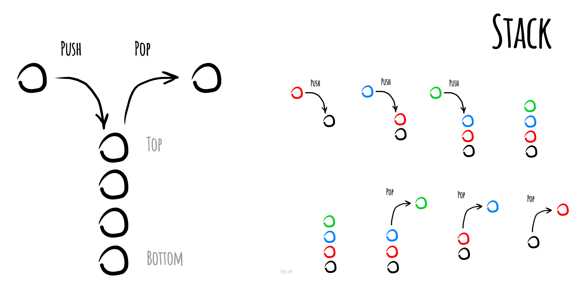

## Стек

**Стек** - это структура данных, которая работает по принципу LIFO (last in, first out / последним пришел, первым вышел). То есть элементы помещаются в стек по очереди, а извлекаются обратным порядком: сначала извлекается элемент, добавленный последним, затем предпоследний и т.д.

Примером стека может быть стопка тарелок: мы кладем новую тарелку сверху, а когда хотим взять тарелку, берем верхнюю, а не нижнюю.

Операции, которые можно выполнить со стеком:

- добавление элемента в стек (push)
- извлечение элемента из стека (pop)

Дополнительно: получение элемента, находящегося на вершине стека без его извлечения.

Стек используют для решения различных задач. Например для хранения и отслеживания вызовов функций.

